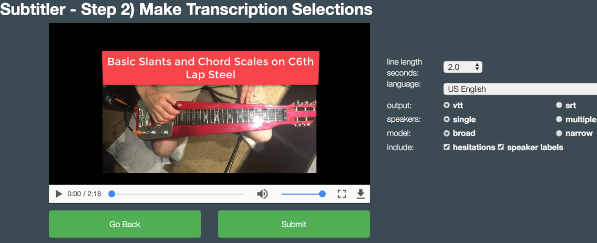
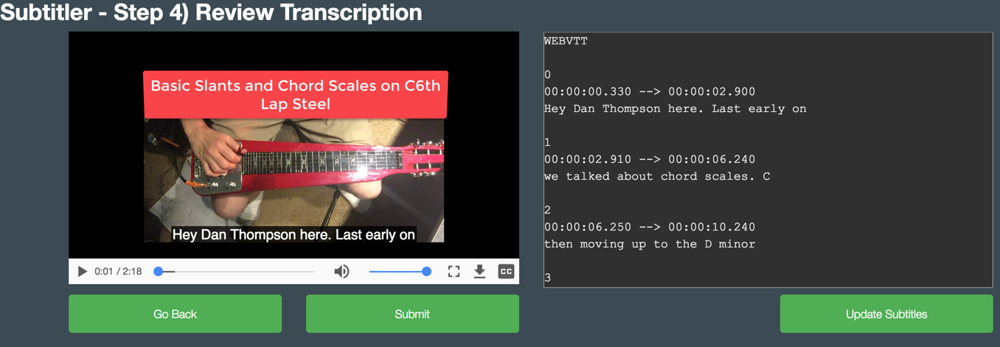

# Node.js Subtitler-All-NodeJS

This demo application showcases IBM Watson's Speech to Text (STT) service. It provides a node.js express front end to import and process video files, and generates closed captions in either VTT or SRT format. SRT is compatible with YouTube. VTT is compatible with most other systems. Previous versions of this demo used a combination of Node.js for the UI and Node-Red for the audio stripper and Watson interface. I use it sometimes to subtitle my videos on YouTube, like this song about pizza for example: https://www.youtube.com/watch?v=NUdJGCHLNlU

Among the many choices it provides are language, multiple speaker support, VTT or SRT output, and several others.

It has a rudimentary caption editor and preview mode so you can fine tune the output.

It is not meant to be a production-ready solution and should only be used with short videos. Normally a one or two minute video is good enough to demonstrate the idea of using IBM Watson for closed captioning. For a production approach you might want to be able to queue up multiple videos, be able to track their status, and get notification when they are complete. IBM BPM could be a good candidate for this kind of solution.

In the current implementation it strips the audio portion of the video out to a separate mp3 file. MP3 was mainly chosen to save space and to improve performance. The mp3 is sent to Watson, which returns raw STT results. The STT to Closed Caption transformation is done using another of my git projects that I've included in this one.

This solution stores your video, the stripped audio, the raw Watson STT results, and the Closed Caption results to intermediate files located in public/uploads. It is designed to delete them upon restart. So take this into account if privacy is an issue. It's just a demo, but if you're demoing with someone else's content make sure they're cool with it.

## Run the app locally

node app.js

*Prereq*: ffmpeg, which probably limits where you can run this, and is also one of the reasons I don't have it running in a Docker container yet, nor on Bluemix. I run it locally on my desktop.

Create your local .env file from the sample env provided. Get your Watson Speech to Text credentials when setting up that service on IBM Cloud (formerly Bluemix). Set the path to your ffmpeg and the port number for the webapp.

By default the browser opens on port 8888 and walks you through selecting a video, previewing it, selecting options, sending to to watson (currently a white screen with no progress bar), previewing and editing the results, and then showing the closed caption file so you can copy / paste it to a file of your choosing.

The whole thing takes about as long as the video itself. So a 2 minute video should take about 2 minutes to process.

Useful tip: Run your videos through Handbrake before submitting to Subtitler (http://handbrake.fr). It can compress them significantly, and improve performance.

Here is a screenshot of the settings page:

And one of the review page:

